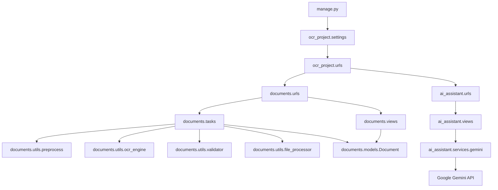
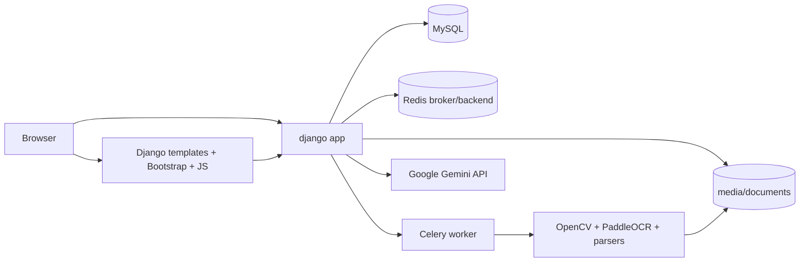
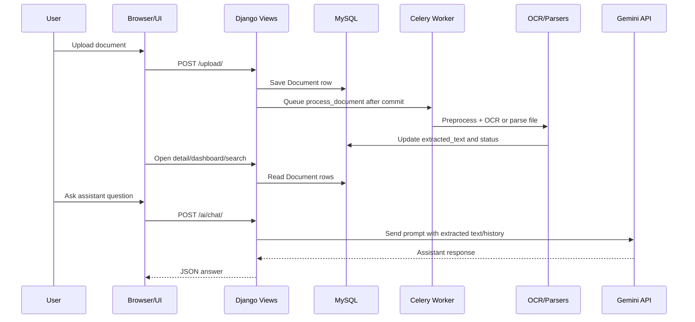
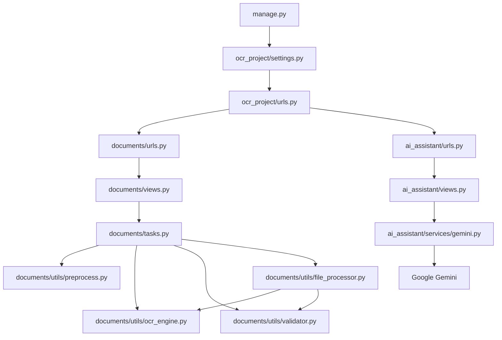

# Project Analysis

## 1) Overview

This project is a Django-based OCR and document intelligence system built for uploading documents, extracting text in the background, searching extracted content, exporting text, and chatting with processed documents through a Gemini-backed assistant.

Primary runtime entry points:
- [manage.py](C:/Users/gyana/Desktop/ocr_project/manage.py)
- [ocr_project/settings.py](C:/Users/gyana/Desktop/ocr_project/ocr_project/settings.py)
- [ocr_project/urls.py](C:/Users/gyana/Desktop/ocr_project/ocr_project/urls.py)
- [ocr_project/celery.py](C:/Users/gyana/Desktop/ocr_project/ocr_project/celery.py)

Main app modules:
- [documents/views.py](C:/Users/gyana/Desktop/ocr_project/documents/views.py)
- [documents/tasks.py](C:/Users/gyana/Desktop/ocr_project/documents/tasks.py)
- [documents/utils/file_processor.py](C:/Users/gyana/Desktop/ocr_project/documents/utils/file_processor.py)
- [documents/utils/ocr_engine.py](C:/Users/gyana/Desktop/ocr_project/documents/utils/ocr_engine.py)
- [ai_assistant/views.py](C:/Users/gyana/Desktop/ocr_project/ai_assistant/views.py)
- [ai_assistant/services/gemini.py](C:/Users/gyana/Desktop/ocr_project/ai_assistant/services/gemini.py)

## 2) Tech Stack

### Frameworks and services
- Django 5.2.15 for web app routing, templates, auth, ORM, sessions, admin, and static/media handling.
- Celery for asynchronous OCR jobs.
- Redis as the Celery broker/backend, configured locally at `redis://localhost:6379/0`.
- MySQL as the primary database.
- Google Gemini via `google-genai` for assistant chat and summarization.

### OCR and document processing
- OpenCV for image preprocessing.
- PaddleOCR / PaddlePaddle for OCR.
- PyMuPDF (`fitz`) for PDF page rendering and direct text extraction.
- `python-docx` for DOCX parsing.
- `openpyxl` for XLSX parsing.
- Python `csv` module for CSV parsing.
- `reportlab` for PDF export.

### Frontend
- Django templates.
- Bootstrap 5 from CDN.
- Marked + DOMPurify from CDN for assistant markdown rendering and sanitization.

## 3) Folder Structure and Purpose

```text
ocr_project/
  manage.py                Django command-line entry point
  ocr_project/             Project settings, URL routing, Celery bootstrap
  documents/               OCR/document workflow app
  ai_assistant/            Gemini-backed assistant app
  templates/               Django templates for both apps
  media/                   Uploaded files and generated media at runtime
  requirements.txt         Python dependencies
  README.md                Setup and feature summary
  .env, .env.example       Environment variables
```

### `ocr_project/`
- `settings.py`: project configuration, database, media, auth redirects, Gemini, and Celery settings.
- `urls.py`: root routing for admin, document app, and assistant app.
- `celery.py`: Celery application bootstrap and task autodiscovery.
- `wsgi.py` / `asgi.py`: deployment entry points.
- `__init__.py`: exposes the Celery app to Django.

### `documents/`
- Owns upload, OCR, search, export, auth, dashboard, and document lifecycle logic.
- Contains the `Document` model, Celery task, OCR/file parsing utilities, and admin customizations.

### `ai_assistant/`
- Owns Gemini-powered chat, summarization, and per-document/general session history.

### `templates/`
- Django templates for document pages and the assistant UI.
- Most UI logic is inline in templates rather than in static JS files.

## 4) Important Files and What They Do

| File | Purpose | Key responsibilities |
|---|---|---|
| [manage.py](C:/Users/gyana/Desktop/ocr_project/manage.py) | Django launcher | Sets `DJANGO_SETTINGS_MODULE` and runs management commands. |
| [ocr_project/settings.py](C:/Users/gyana/Desktop/ocr_project/ocr_project/settings.py) | Global config | Loads `.env`, configures MySQL, media, auth redirects, Celery, Gemini. |
| [ocr_project/urls.py](C:/Users/gyana/Desktop/ocr_project/ocr_project/urls.py) | Root routing | Wires `/admin/`, `/ai/`, and document routes. |
| [ocr_project/celery.py](C:/Users/gyana/Desktop/ocr_project/ocr_project/celery.py) | Background job bootstrap | Creates Celery app and autodiscovers tasks. |
| [documents/models.py](C:/Users/gyana/Desktop/ocr_project/documents/models.py) | Database schema | Defines `Document` with file, type, OCR text, status, timestamps. |
| [documents/views.py](C:/Users/gyana/Desktop/ocr_project/documents/views.py) | Web views | Handles upload, detail, search, delete, edit, login/logout, dashboard, exports. |
| [documents/tasks.py](C:/Users/gyana/Desktop/ocr_project/documents/tasks.py) | Async OCR job | Runs preprocessing + OCR/parsing and updates document status/text. |
| [documents/utils/file_processor.py](C:/Users/gyana/Desktop/ocr_project/documents/utils/file_processor.py) | File parsing helpers | Detects file type and extracts text from PDF/DOCX/XLSX/CSV. |
| [documents/utils/preprocess.py](C:/Users/gyana/Desktop/ocr_project/documents/utils/preprocess.py) | Image preprocessing | Denoises, thresholds, deskews images before OCR. |
| [documents/utils/ocr_engine.py](C:/Users/gyana/Desktop/ocr_project/documents/utils/ocr_engine.py) | OCR engine wrapper | Initializes PaddleOCR and converts image OCR output to text items. |
| [documents/utils/validator.py](C:/Users/gyana/Desktop/ocr_project/documents/utils/validator.py) | OCR validation | Filters OCR items by confidence and cleans text. |
| [documents/admin.py](C:/Users/gyana/Desktop/ocr_project/documents/admin.py) | Django admin UI | Adds badges, previews, filters, search, and custom layout for `Document`. |
| [documents/urls.py](C:/Users/gyana/Desktop/ocr_project/documents/urls.py) | Document routes | Exposes dashboard, upload, detail, edit, delete, search, auth, export. |
| [ai_assistant/views.py](C:/Users/gyana/Desktop/ocr_project/ai_assistant/views.py) | Assistant API/views | Serves assistant page and JSON endpoints for chat, history, summarize, clear. |
| [ai_assistant/services/gemini.py](C:/Users/gyana/Desktop/ocr_project/ai_assistant/services/gemini.py) | Gemini client wrapper | Builds prompts, calls Gemini, normalizes errors. |
| [ai_assistant/urls.py](C:/Users/gyana/Desktop/ocr_project/ai_assistant/urls.py) | Assistant routes | Maps assistant UI and JSON endpoints. |
| [templates/documents/base.html](C:/Users/gyana/Desktop/ocr_project/templates/documents/base.html) | Shared layout | Navbar, bootstrap, message rendering. |
| [templates/documents/dashboard.html](C:/Users/gyana/Desktop/ocr_project/templates/documents/dashboard.html) | Main dashboard | Document counts, filters, recent docs table. |
| [templates/documents/upload.html](C:/Users/gyana/Desktop/ocr_project/templates/documents/upload.html) | Upload form | File upload UI with client-side loading overlay. |
| [templates/documents/detail.html](C:/Users/gyana/Desktop/ocr_project/templates/documents/detail.html) | Document detail | Displays OCR status/text and export links. |
| [templates/documents/search.html](C:/Users/gyana/Desktop/ocr_project/templates/documents/search.html) | Search page | Searches extracted text and lists matches. |
| [templates/documents/login.html](C:/Users/gyana/Desktop/ocr_project/templates/documents/login.html) | Login page | Username/password login form. |
| [templates/documents/edit.html](C:/Users/gyana/Desktop/ocr_project/templates/documents/edit.html) | Edit title | Allows title updates. |
| [templates/documents/confirm_delete.html](C:/Users/gyana/Desktop/ocr_project/templates/documents/confirm_delete.html) | Delete confirm | Confirms file deletion. |
| [templates/ai_assistant/assistant.html](C:/Users/gyana/Desktop/ocr_project/templates/ai_assistant/assistant.html) | Assistant UI | Two-mode chat UI, document selector, summary controls, history rendering. |
| [requirements.txt](C:/Users/gyana/Desktop/ocr_project/requirements.txt) | Dependencies | Python packages and version pins. |
| [README.md](C:/Users/gyana/Desktop/ocr_project/README.md) | Project docs | Setup, feature list, and local Redis/Celery startup instructions. |
| [.env](C:/Users/gyana/Desktop/ocr_project/.env) | Local config | Gemini variables only, from current scan. |
| [.env.example](C:/Users/gyana/Desktop/ocr_project/.env.example) | Example config | Currently modified in working tree; contains Gemini variables. |

## 5) Implemented Features and Files Involved

### Document upload and OCR processing
- Upload validation and creation: [documents/views.py](C:/Users/gyana/Desktop/ocr_project/documents/views.py)
- Async background OCR: [documents/tasks.py](C:/Users/gyana/Desktop/ocr_project/documents/tasks.py)
- Image preprocessing and OCR: [documents/utils/preprocess.py](C:/Users/gyana/Desktop/ocr_project/documents/utils/preprocess.py), [documents/utils/ocr_engine.py](C:/Users/gyana/Desktop/ocr_project/documents/utils/ocr_engine.py), [documents/utils/validator.py](C:/Users/gyana/Desktop/ocr_project/documents/utils/validator.py)
- PDF/DOCX/XLSX/CSV extraction: [documents/utils/file_processor.py](C:/Users/gyana/Desktop/ocr_project/documents/utils/file_processor.py)

### Document browsing and lifecycle
- Dashboard with counts and filters: [documents/views.py](C:/Users/gyana/Desktop/ocr_project/documents/views.py), [templates/documents/dashboard.html](C:/Users/gyana/Desktop/ocr_project/templates/documents/dashboard.html)
- Detail, edit, delete, download, and export: [documents/views.py](C:/Users/gyana/Desktop/ocr_project/documents/views.py), [templates/documents/detail.html](C:/Users/gyana/Desktop/ocr_project/templates/documents/detail.html), [templates/documents/edit.html](C:/Users/gyana/Desktop/ocr_project/templates/documents/edit.html), [templates/documents/confirm_delete.html](C:/Users/gyana/Desktop/ocr_project/templates/documents/confirm_delete.html)
- Search by OCR text: [documents/views.py](C:/Users/gyana/Desktop/ocr_project/documents/views.py), [templates/documents/search.html](C:/Users/gyana/Desktop/ocr_project/templates/documents/search.html)

### Authentication
- Login/logout and register flow: [documents/views.py](C:/Users/gyana/Desktop/ocr_project/documents/views.py)
- Login template: [templates/documents/login.html](C:/Users/gyana/Desktop/ocr_project/templates/documents/login.html)
- Register template exists but is commented out and not routed: [templates/documents/register.html](C:/Users/gyana/Desktop/ocr_project/templates/documents/register.html), [documents/urls.py](C:/Users/gyana/Desktop/ocr_project/documents/urls.py)

### AI assistant
- Assistant UI and JSON endpoints: [ai_assistant/views.py](C:/Users/gyana/Desktop/ocr_project/ai_assistant/views.py), [templates/ai_assistant/assistant.html](C:/Users/gyana/Desktop/ocr_project/templates/ai_assistant/assistant.html)
- Gemini prompt construction and error mapping: [ai_assistant/services/gemini.py](C:/Users/gyana/Desktop/ocr_project/ai_assistant/services/gemini.py)

### Admin
- Custom `DocumentAdmin` display, filtering, badge rendering, file preview: [documents/admin.py](C:/Users/gyana/Desktop/ocr_project/documents/admin.py)

## 6) Libraries and Why They Are Used

| Library / package | Where used | Why it exists |
|---|---|---|
| Django | whole app | Web framework, ORM, auth, templates, sessions, admin. |
| Celery | [ocr_project/celery.py](C:/Users/gyana/Desktop/ocr_project/ocr_project/celery.py), [documents/tasks.py](C:/Users/gyana/Desktop/ocr_project/documents/tasks.py) | Offload OCR work from request/response cycle. |
| Redis | Celery config in [ocr_project/settings.py](C:/Users/gyana/Desktop/ocr_project/ocr_project/settings.py) | Broker and result backend for Celery. |
| mysqlclient | database backend | MySQL connector for Django ORM. |
| OpenCV (`cv2`) | preprocessing and task worker | Noise reduction, thresholding, deskewing, image write. |
| PaddleOCR / PaddlePaddle | OCR engine | Text recognition from images and scanned PDF pages. |
| PyMuPDF (`fitz`) | PDF extraction | Direct text extraction and page rasterization for scanned PDFs. |
| `python-docx` | file processor | Read DOCX paragraphs and tables. |
| `openpyxl` | file processor | Read XLSX worksheets and cells. |
| `reportlab` | export endpoint | Generate downloadable PDF from extracted text. |
| `google-genai` | assistant service | Call Gemini for chat and summaries. |
| `python-dotenv` | settings | Load `.env` values into Django settings. |
| Bootstrap 5 | templates | Quick styling and component layout. |
| Marked + DOMPurify | assistant UI | Render markdown safely in assistant responses. |

### Important dependency mismatch
- `documents/utils/file_processor.py` imports `fitz`, but `requirements.txt` does not explicitly list PyMuPDF. That is a packaging gap.
- `requirements.txt` also contains packages not referenced directly in source, including `pdfplumber`, `pypdf`, and `pdfminer.six` based on this scan.

## 7) Important Functions and Classes

| Function / class | File | Used by |
|---|---|---|
| `Document` | [documents/models.py](C:/Users/gyana/Desktop/ocr_project/documents/models.py:3) | Queried by document views, Celery task, assistant views, admin. |
| `process_document` | [documents/tasks.py](C:/Users/gyana/Desktop/ocr_project/documents/tasks.py:10) | Enqueued from `upload_document` via `transaction.on_commit(...process_document.delay(...))`. |
| `get_file_type` | [documents/utils/file_processor.py](C:/Users/gyana/Desktop/ocr_project/documents/utils/file_processor.py:8) | Called by `upload_document`. |
| `extract_from_pdf` | [documents/utils/file_processor.py](C:/Users/gyana/Desktop/ocr_project/documents/utils/file_processor.py:23) | Called by `process_file`. |
| `extract_from_docx` | [documents/utils/file_processor.py](C:/Users/gyana/Desktop/ocr_project/documents/utils/file_processor.py:68) | Called by `process_file`. |
| `extract_from_xlsx` | [documents/utils/file_processor.py](C:/Users/gyana/Desktop/ocr_project/documents/utils/file_processor.py:85) | Called by `process_file`. |
| `extract_from_csv` | [documents/utils/file_processor.py](C:/Users/gyana/Desktop/ocr_project/documents/utils/file_processor.py:99) | Called by `process_file`. |
| `process_file` | [documents/utils/file_processor.py](C:/Users/gyana/Desktop/ocr_project/documents/utils/file_processor.py:110) | Called by `process_document`, indirectly from PDF/DOCX/XLSX/CSV uploads. |
| `preprocess_image` | [documents/utils/preprocess.py](C:/Users/gyana/Desktop/ocr_project/documents/utils/preprocess.py:4) | Called by `process_document` for image uploads. |
| `extract_text` | [documents/utils/ocr_engine.py](C:/Users/gyana/Desktop/ocr_project/documents/utils/ocr_engine.py:11) | Called by `process_document` and `extract_from_pdf`. |
| `validate_text` | [documents/utils/validator.py](C:/Users/gyana/Desktop/ocr_project/documents/utils/validator.py:3) | Called by `process_document` and `extract_from_pdf`. |
| `DocumentAdmin` | [documents/admin.py](C:/Users/gyana/Desktop/ocr_project/documents/admin.py:7) | Registered with Django admin. |
| `assistant_page` | [ai_assistant/views.py](C:/Users/gyana/Desktop/ocr_project/ai_assistant/views.py:61) | Renders assistant UI with done documents. |
| `history` | [ai_assistant/views.py](C:/Users/gyana/Desktop/ocr_project/ai_assistant/views.py:69) | Called by assistant template JS. |
| `chat` | [ai_assistant/views.py](C:/Users/gyana/Desktop/ocr_project/ai_assistant/views.py:81) | Called by assistant template JS. |
| `summarize` | [ai_assistant/views.py](C:/Users/gyana/Desktop/ocr_project/ai_assistant/views.py:124) | Called by assistant template JS. |
| `clear_history` | [ai_assistant/views.py](C:/Users/gyana/Desktop/ocr_project/ai_assistant/views.py:152) | Called by assistant template JS. |
| `_generate` | [ai_assistant/services/gemini.py](C:/Users/gyana/Desktop/ocr_project/ai_assistant/services/gemini.py:33) | Used by all Gemini prompt helpers. |
| `chat_with_document` | [ai_assistant/services/gemini.py](C:/Users/gyana/Desktop/ocr_project/ai_assistant/services/gemini.py:80) | Called by `chat` in document mode. |
| `summarize_document` | [ai_assistant/services/gemini.py](C:/Users/gyana/Desktop/ocr_project/ai_assistant/services/gemini.py:112) | Called by `summarize`. |
| `general_chat` | [ai_assistant/services/gemini.py](C:/Users/gyana/Desktop/ocr_project/ai_assistant/services/gemini.py:145) | Called by `chat` in general mode. |

## 8) Complete Workflow: Start to User Response

1. Django starts through [manage.py](C:/Users/gyana/Desktop/ocr_project/manage.py), which sets `DJANGO_SETTINGS_MODULE` to `ocr_project.settings`.
2. [ocr_project/settings.py](C:/Users/gyana/Desktop/ocr_project/ocr_project/settings.py) loads `.env`, configures MySQL, media paths, Celery broker/backend, Gemini config, and auth redirects.
3. [ocr_project/urls.py](C:/Users/gyana/Desktop/ocr_project/ocr_project/urls.py) routes requests to the document app, assistant app, and admin.
4. When a user uploads a file, `upload_document()` in [documents/views.py](C:/Users/gyana/Desktop/ocr_project/documents/views.py) validates file presence, size, extension-based type, and creates a `Document` row.
5. The upload view uses `transaction.on_commit(...)` to queue [documents/tasks.py](C:/Users/gyana/Desktop/ocr_project/documents/tasks.py) only after the database row is safely committed.
6. Celery worker picks up `process_document(document_id)`.
7. For images, the task preprocesses the image, writes a temporary file, OCRs it, and validates the text.
8. For PDFs, DOCX, XLSX, and CSV files, `process_file()` extracts text using the relevant parser.
9. The task updates `Document.extracted_text` and sets `status` to `done` or `failed`.
10. The detail page auto-refreshes while the status is `pending` or `processing`, so the user sees the extraction complete without manual reload.
11. Dashboard, search, and detail views read from the MySQL `Document` table.
12. The assistant page loads all `done` documents; its JavaScript sends JSON requests to `/ai/chat/`, `/ai/summarize/`, `/ai/history/`, and `/ai/clear/`.
13. [ai_assistant/views.py](C:/Users/gyana/Desktop/ocr_project/ai_assistant/views.py) calls [ai_assistant/services/gemini.py](C:/Users/gyana/Desktop/ocr_project/ai_assistant/services/gemini.py), which sends prompts to Gemini.
14. The assistant response is returned as JSON, rendered in the browser, and appended to session history.
15. Export endpoints generate TXT or PDF files from `Document.extracted_text` and stream them back to the user.

## 9) File and Module Dependency / Data Flow

### Backend dependencies
- `manage.py` -> `ocr_project.settings`
- `ocr_project.settings` -> MySQL, Redis, Gemini env values, template/media settings
- `ocr_project.urls` -> `documents.urls`, `ai_assistant.urls`
- `documents.views` -> `documents.models`, `documents.tasks`, `documents.utils.file_processor`
- `documents.tasks` -> `documents.models`, `documents.utils.preprocess`, `documents.utils.ocr_engine`, `documents.utils.validator`, `documents.utils.file_processor`
- `ai_assistant.views` -> `documents.models`, `ai_assistant.services.gemini`
- `ai_assistant.services.gemini` -> Google Gemini client and Django settings

### Data flow
- Uploaded file -> `media/documents/` -> `Document.file`
- OCR output -> `Document.extracted_text`
- Processing state -> `Document.status`
- Assistant history -> Django session
- Gemini prompt/response -> JSON API over HTTP

### Dependency graph


## 10) Frontend -> Backend -> Database/API Interactions

### Document app
- `templates/documents/upload.html` posts `multipart/form-data` to `upload_document`.
- `templates/documents/detail.html` displays the current model state and auto-refreshes while extraction is running.
- `templates/documents/search.html` issues a GET request with `q=...` and renders matching extracted text.
- `templates/documents/dashboard.html` links to query-filtered views and document actions.

### Assistant app
- `templates/ai_assistant/assistant.html` uses fetch + JSON.
- `csrfToken()` reads the CSRF cookie and sends `X-CSRFToken`.
- `chat` and `summarize` return JSON, not HTML.
- `Marked` renders assistant markdown; `DOMPurify` sanitizes it before insertion.

### Persistence layers
- MySQL stores `Document` rows and auth/session data.
- Redis backs Celery broker/result traffic.
- Uploaded files live in the filesystem under `media/documents/`.
- Gemini is an external API and is not stored locally.

## 11) Database Model and Schema

### `Document` model
Defined in [documents/models.py](C:/Users/gyana/Desktop/ocr_project/documents/models.py).

Fields:
- `title`: document label
- `file`: uploaded file path
- `file_type`: `image`, `pdf`, `docx`, `xlsx`, or `csv`
- `extracted_text`: OCR / parser output
- `status`: `pending`, `processing`, `done`, `failed`
- `uploaded_at`: creation timestamp

### Migration history
- `0001_initial.py`: created `Document` with `image`, `title`, `extracted_text`, `uploaded_at`.
- `0002_remove_document_image_document_file_and_more.py`: converted to generic `file` plus `file_type`.
- `0003_document_status.py`: added processing state.

## 12) OCR / ML Pipeline

### Image pipeline
1. `preprocess_image()` in [documents/utils/preprocess.py](C:/Users/gyana/Desktop/ocr_project/documents/utils/preprocess.py) loads the image.
2. Noise is reduced with `fastNlMeansDenoising`.
3. Contrast is enhanced with CLAHE.
4. Thresholding converts the image to a cleaner binary form.
5. Deskewing rotates the image to reduce tilt.
6. `extract_text()` in [documents/utils/ocr_engine.py](C:/Users/gyana/Desktop/ocr_project/documents/utils/ocr_engine.py) runs PaddleOCR.
7. `validate_text()` filters low-confidence OCR items and removes junk characters.

### PDF pipeline
1. `extract_from_pdf()` in [documents/utils/file_processor.py](C:/Users/gyana/Desktop/ocr_project/documents/utils/file_processor.py) opens the PDF with PyMuPDF.
2. If page text exists, it uses direct extraction.
3. If a page is scanned, it rasterizes the page and sends it through the OCR image pipeline.
4. This creates a mixed PDF pipeline that handles both digital and scanned PDFs.

### Non-image files
- DOCX: paragraphs and tables via `python-docx`.
- XLSX: worksheets and non-empty cells via `openpyxl`.
- CSV: row-by-row parsing via `csv.reader`.

## 13) Configuration Files and Environment Variables

### `settings.py`
- `SECRET_KEY`: hardcoded in source.
- `DEBUG = True`
- `ALLOWED_HOSTS = []`
- MySQL credentials are hardcoded in `DATABASES`.
- `MEDIA_ROOT` and `MEDIA_URL` configure upload storage and public serving.
- `LOGIN_URL` and `LOGIN_REDIRECT_URL` define auth flow.
- `GEMINI_API_KEY` and `GEMINI_MODEL` come from environment variables.
- `CELERY_BROKER_URL` and `CELERY_RESULT_BACKEND` default to `redis://localhost:6379/0`.

### `.env` / `.env.example`
- Current `.env` contains only `GEMINI_API_KEY` and `GEMINI_MODEL`.
- `.env.example` is modified in the working tree and currently contains Gemini variables.
- No Redis or MySQL environment variables are wired into the code at present.

### `README.md`
- Documents a local-first setup.
- Explicitly instructs users to start Redis locally, optionally via Docker.

## 14) Security, Performance, and Code Quality

### Security
- Hardcoded `SECRET_KEY` in [ocr_project/settings.py](C:/Users/gyana/Desktop/ocr_project/ocr_project/settings.py).
- Hardcoded MySQL root credentials in [ocr_project/settings.py](C:/Users/gyana/Desktop/ocr_project/ocr_project/settings.py).
- `DEBUG = True` and empty `ALLOWED_HOSTS` indicate development-only settings.
- `.env.example` appears to contain a live Gemini API key in the current working tree; that should be treated as compromised and rotated.
- Upload validation is extension-based, not MIME/content-based.
- Assistant endpoints require login and sanitize markdown output with DOMPurify, which is good.

### Performance
- Celery keeps OCR work out of the request thread.
- PaddleOCR is initialized once at import time, which avoids repeated model loading but increases process startup cost.
- Search uses `icontains` on `extracted_text`; this will become slow on large datasets without indexing or full-text search.
- PDF export renders in-memory; large documents will cost CPU and memory in the request process.
- Detail auto-refresh every 5 seconds can generate repeated traffic while a task is pending.

### Code quality
- Good separation between web requests, background OCR, and Gemini integration.
- `transaction.on_commit()` is the correct pattern for queuing background work after a successful save.
- The assistant prompt explicitly constrains document chat to the selected OCR text only.
- Several files contain mojibake / encoding artifacts, such as `←` and `⬇`, which suggests inconsistent source encoding.
- Error handling is mixed: some broad `except:` blocks hide failures, and `print()` is used instead of structured logging.

## 15) Unused, Dead, or Suspicious Code

- `register_view()` exists in [documents/views.py](C:/Users/gyana/Desktop/ocr_project/documents/views.py) but is not routed because the register path is commented out in [documents/urls.py](C:/Users/gyana/Desktop/ocr_project/documents/urls.py).
- [templates/documents/register.html](C:/Users/gyana/Desktop/ocr_project/templates/documents/register.html) is commented out and effectively dead UI.
- `pdfplumber` is imported in [documents/utils/file_processor.py](C:/Users/gyana/Desktop/ocr_project/documents/utils/file_processor.py) but not used.
- `io` is imported in [documents/views.py](C:/Users/gyana/Desktop/ocr_project/documents/views.py) but not used.
- `Count` is imported at the top of [documents/views.py](C:/Users/gyana/Desktop/ocr_project/documents/views.py) and again inside `dashboard()`.
- `pdfminer.six` and `pypdf` are present in `requirements.txt` but are not referenced in the code scan.
- `fitz` is used but not listed in `requirements.txt`; packaging is incomplete unless another dependency pulls it in indirectly.
- The initial migration history shows the model evolved, but there is no code cleanup around the old `image` field path beyond migration files.

## 16) Improvement Suggestions

1. Move `SECRET_KEY`, MySQL credentials, and broker URLs into environment variables.
2. Remove the live Gemini key from `.env.example` and rotate any exposed key.
3. Add `PyMuPDF` explicitly to `requirements.txt`.
4. Replace extension-only file validation with MIME/content validation.
5. Add tests for upload, OCR task success/failure, assistant endpoints, and export endpoints.
6. Replace `print()` calls with `logging`.
7. Remove dead register UI or re-enable the route consistently.
8. Add search indexing or full-text search for `extracted_text`.
9. Normalize source file encoding to UTF-8 and remove mojibake.
10. Reduce duplicated imports and unused packages to make the dependency surface clearer.

## 17) Mermaid Architecture Diagram



## 18) Mermaid Workflow Diagram



## 19) Mermaid Dependency Graph



## 20) Bottom Line

This codebase is a functional local-first OCR application with a clear split between document processing and AI assistant features. The strongest implementation choices are the Celery-backed background OCR flow, the file-type-specific extraction pipeline, and the Gemini assistant guardrails. The main gaps are configuration hygiene, missing/unused dependencies, dead register code, weak file validation, and no automated tests.
