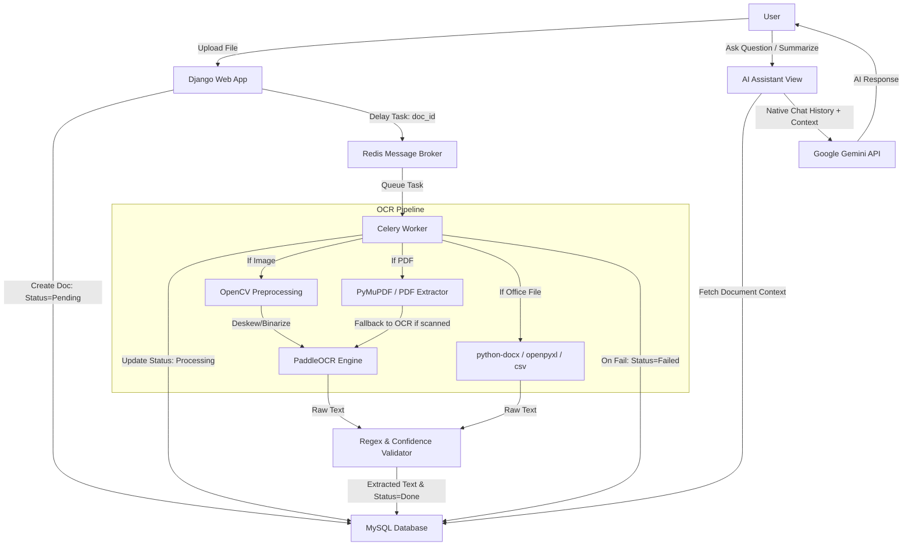

# 📄 Intelligent Document Processing & OCR Automation System

[](https://www.python.org/)
[](https://www.djangoproject.com/)
[](https://github.com/PaddlePaddle/PaddleOCR)
[](https://deepmind.google/technologies/gemini/)
[](https://docs.celeryq.dev/)

An enterprise-grade Intelligent Document Processing (IDP) and OCR Automation System designed and developed for the **Indian Oil Corporation Limited (IOCL)** internship project. The application automates document intake, text extraction, validation, and leverages Google Gemini to allow natural language interactions, summarization, and document intelligence queries.

---

## 🏗 System Architecture Workflow

The flow below represents the life cycle of a document from upload to OCR extraction, validation, storage, and AI interactions:



---

## ✨ Features

- **Multi-Format Upload Support**: Accepts Images, PDFs, DOCX, XLSX, and CSV files (up to 20MB).
- **Advanced Image Preprocessing**: Built-in OpenCV pipeline performing:
  - Noise reduction and deskewing
  - Adaptive thresholding and binarization
  - Contrast enhancement to maximize OCR accuracy
- **Asynchronous Task Queueing**: Uses Celery and Redis to handle document processing in the background, keeping the user interface fast and responsive.
- **Dynamic Work Progress Tracking**: Real-time progress bar (0% to 100%) and percentage updates on the detail page while Celery works.
- **Enhanced Error Handling & Reprocessing**:
  - Direct warnings and errors captured gracefully.
  - One-click **Reprocess / Retry** button for failed or poorly-extracted documents.
- **Native AI Assistant (Gemini 2.5-Flash)**:
  - **Document Chat**: Select any processed document to ask contextual questions restricted *only* to the document text.
  - **Auto-Summarization**: Generate Short, Detailed, Bullet-point, or Key Takeaway summaries.
  - **General AI Chat with Document Referral**: Ask general questions, and the assistant will dynamically search the database snippets and reference relevant files with clickable markdown links (`[Title](/document/ID/)`).
  - **Native Context Retention**: Real-time multi-turn conversation tracking using native Gemini API history structure (`user` / `model` roles).
- **Browser History Integration**: Prevents the Back button from throwing users back into loading `/upload/` post-submission, redirecting them to the Dashboard instead.

---

## 🛠 Tech Stack

| Layer | Technologies |
|---|---|
| **Backend Framework** | Python 3.11, Django 5.2.15 |
| **Database** | MySQL |
| **Asynchronous Worker** | Celery 5.4.0, Redis (Broker/Backend) |
| **Computer Vision** | OpenCV (`opencv-python`), Pillow |
| **OCR Engines** | PaddleOCR 3.7.0, PyMuPDF (`pymupdf`), PDFPlumber |
| **Generative AI** | Google GenAI SDK (`google-genai`), Gemini 2.5-Flash |
| **Frontend** | Bootstrap 5, Vanilla CSS, JavaScript, Marked.js, DOMPurify |

---

## 📄 Supported Formats

| Format | Extension | Processing Module |
|---|---|---|
| **Images** | `.jpg`, `.jpeg`, `.png`, `.bmp`, `.tiff` | OpenCV + PaddleOCR Engine |
| **PDF Documents** | `.pdf` | PyMuPDF (digital text) / PaddleOCR fallback (scanned pages) |
| **Word Docs** | `.docx` | `python-docx` parser (including inline tables) |
| **Spreadsheets** | `.xlsx` | `openpyxl` parser sheet-by-sheet |
| **Data sheets** | `.csv` | Python `csv` reader (UTF-8 encoding fallback) |

---

## ⚙️ Environment Variables Configuration

The project reads settings from a `.env` file in the root directory. Copy the template and customize it:

```bash
# In the project root:
copy .env.example .env
```

Ensure your `.env` contains:

```env
# Gemini API Key
GEMINI_API_KEY=your_gemini_api_key_here
GEMINI_MODEL=gemini-2.5-flash

# Django Secret Key and Debug Settings
SECRET_KEY=django-insecure-your-secret-key-here
DEBUG=True
ALLOWED_HOSTS=127.0.0.1,localhost

# MySQL Database Configurations
DB_NAME=ocr_db
DB_USER=root
DB_PASSWORD=your_mysql_password_here
DB_HOST=localhost
DB_PORT=3306

# Redis and Celery Settings
CELERY_BROKER_URL=redis://localhost:6379/0
CELERY_RESULT_BACKEND=redis://localhost:6379/0
```

---

## 🚀 Setup & Installation Guide (A to Z)

### Prerequisites
- Python 3.11.x installed.
- MySQL server installed and running.
- Redis server running (locally or in a Docker container).

### Step 1: Clone the Repository
```bash
git clone https://github.com/Tinku785/ocr-project.git
cd ocr-project
```

### Step 2: Setup Virtual Environment
```bash
# Create environment
py -3.11 -m venv venv

# Activate on Windows
venv\Scripts\activate
```

### Step 3: Install Required Packages
```bash
python -m pip install --upgrade pip
pip install -r requirements.txt
```
*(Note: `pymupdf` is used for PDFs instead of `fitz` to prevent server-mounting namespace conflicts.)*

### Step 4: Setup MySQL Database
1. Open your MySQL terminal/GUI client.
2. Create the target database:
   ```sql
   CREATE DATABASE ocr_db;
   ```

### Step 5: Run Database Migrations
Configure your `.env` variables first. Then compile and execute migrations:
```bash
python manage.py makemigrations
python manage.py migrate
```

### Step 6: Start Redis Broker
If you have Docker installed, you can spin up Redis instantly:
```bash
docker run --name ocr-redis -p 6379:6379 -d redis:7
```
Or start your local Redis server.

### Step 7: Run Celery Worker Process
Open a **new terminal**, activate the virtual environment, and run:
```bash
venv\Scripts\activate
celery -A ocr_project worker --loglevel=info --pool=solo
```
*(Note: `--pool=solo` is mandatory for Windows environments to run Celery tasks reliably.)*

### Step 8: Start Django Server
In your main terminal, start the web server:
```bash
python manage.py runserver
```

Open your browser and navigate to:
- Dashboard: [http://127.0.0.1:8000/](http://127.0.0.1:8000/)
- AI Assistant: [http://127.0.0.1:8000/ai/](http://127.0.0.1:8000/ai/)

---

## 🔐 Authentication & User Credentials Generation

The system requires authentication to upload documents, view details, or access the AI Assistant.

### 1. Creating Credentials
Since registration is closed in the default deployment (`/register/` URL is disabled in `urls.py`), user accounts must be created via Django's secure command-line management utility:

```bash
python manage.py createsuperuser
```
Follow the prompts to enter a `username`, `email`, and `password`.

### 2. Password Hashing and Encryption Techniques
Django secures credentials using industry-standard password hashing techniques. 
* By default, Django uses **PBKDF2 (Password-Based Key Derivation Function 2)** with a **SHA-256** hashing algorithm.
* **Salt Stretching**: Every password has a unique cryptographic salt added to it and is stretched by running it through **600,000+ iterations** of PBKDF2 to prevent rainbow table attacks.
* If user registration is enabled (by uncommenting the register path in `urls.py`), new users will be created via `User.objects.create_user()`, which automatically applies the same secure PBKDF2 hashing before saving credentials to the database.

---

## 🛠 Troubleshooting

- **No module named 'fitz' / 'frontend' error**:
  Ensure you are using `pymupdf` in `requirements.txt` instead of the PyPI package `fitz`. We replaced the dependency to avoid conflicts with Starlette's static assets router in the `frontend` library.
- **Progress stays at 0%**:
  Celery caches python modules in memory. If you updated your code, you must restart your Celery worker using `Ctrl+C` and running the `celery -A ocr_project worker ...` command again.
- **PaddleOCR installation issues**:
  Ensure you are using Python 3.11 as PaddleOCR and C++ extensions do not fully support newer Python runtimes like 3.12+ out-of-the-box on Windows.
